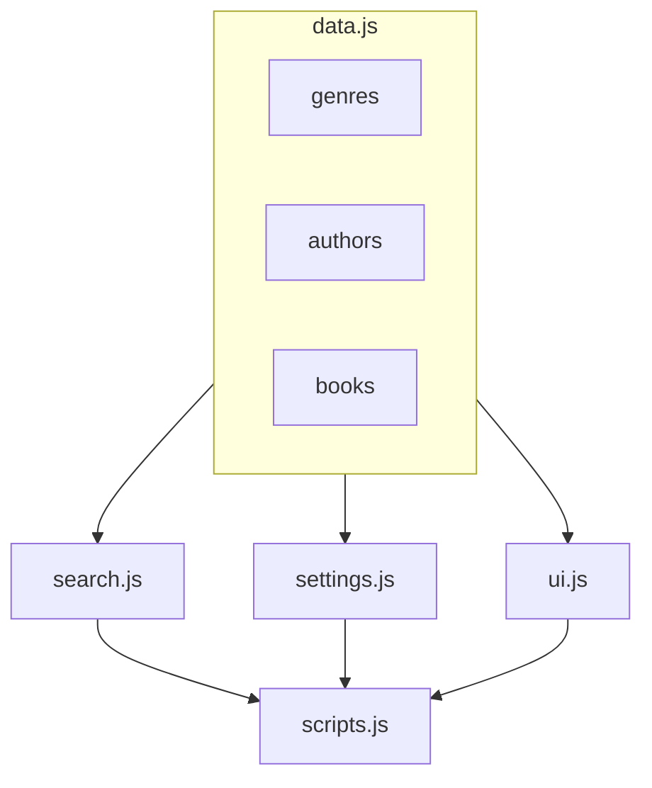

### Project Latout

- scripts.js
- sources
  - data.js
  - search.js
  - settings.js
  - ui.js

## Table showing how the code was abstracted

| File.js     | Purpose                                                                                  |
| ----------- | ---------------------------------------------------------------------------------------- |
| scripts.js  | Houses all the higher order functions to make the file more declarative and easy to read |
| data.js     | Stores the authors, genres, and books data for the project                               |
| search.js   | Houses the helper functions that enable the search functionalities of the app            |
| settings.js | Houses the helper functions that enable the theme switch functionalities of the app      |
| ui.js       | Houses the helper functions responsible for ui alterations in the app                    |

## Here is a simple flow chart:

## Making of the custom element web component BookPreview

### Began with a boiler plate

- added the attributes it will work with
- added the html template in render()
- exported the web component

### Importing to ui.js to update functions that use the new component

- fed as argument in renderbooks for the create element (getting null back in disay)
